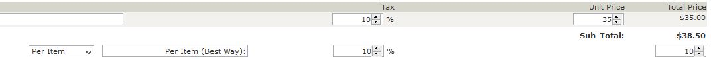
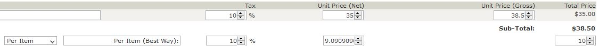

# Edit Orders: Shipping Tax Handling

Starting with _EO_ v4.4.0, any tax on shipping is handled as a separate task. There are three (3) actions taken by _Edit Orders_' processing and each action's handling of the shipping-related cost and tax is slightly different:

1.  Initial entry, for the display of the `update_order` form.
2.  An order "update" from that form.
3.  Adding a product to the order.

A primary element of the tax-handling update is the definition of a field in the database's `orders` table (`shipping_tax_rate`), in which _EO_ initializes and/or saves the order's current shipping tax-rate.  When a store updates its version of _EO_ to v4.4.0 or later, the plugin's admin-level initialization creates that field in the database. That field's value defaults to `null`, indicating that no separate shipping tax-rate has yet been stored for the order.

## Shipping Cost Overrides

While an admin has full control over the order's `shipping_tax_rate`, the order's _shipping cost_ might be changed to 0.00 depending on the store's other configuration settings and/or products present in the order.  This change will not result in the order's `shipping_tax_rate` being changed.

1. If the order is updated to include all virtual products, the order's shipping cost is 0.
2. If the store's configuration for _**Modules->Order Total->Shipping**_ (i.e. `ot_shipping.php`) identifies that orders over a certain value receive free shipping and the order-update or product addition result in a qualifying order, the order's shipping cost is 0.

**Note:** These processes cannot be overridden.

## Action-Based Shipping Tax Handling

### Initial Order Display

When an order's information is gathered from the database for the initial update-form display, _EO_ checks the value for the order's `orders::shipping_tax_rate` field.  If that field's value is not `null`, then the value has been previously recorded and that value is displayed.  Otherwise, _EO_ interrogates the order's current shipping-method to determine the initial tax-rate for the order and stores that value in the database.

### Updating an Order

When an admin-user uses _EO_ to update an order, the shipping cost and associated tax-rate entries are used to update the cost and tax to be applied to the order.  The display for that information entry is slightly different, depending on whether or not the store displays prices with tax (as identified by settings in _**Configuration->My Store**_).

In either case, when the order is updated, the tax-rate value entered is saved in the database as part of the order's update processing.

#### Displaying Prices Without Tax

If the store displays prices _without_ tax, _EO_'s initial data-entry form presents the shipping-related values as:

The admin has full control of the tax-rate (a numeric field in the range 0 to 100, under the **Tax** column) and the shipping cost (a numeric field, under the **Total Price** column).

#### Displaying Prices With Tax

If the store displays prices _with_ tax, _EO_'s initial data-entry form presents the shipping-related values as:

For this case, _EO_ uses a teeny bit of jQuery (based on built-in Zen Cart processing when entering product prices) to aid in the net vs. gross shipping cost.  If the admin changes the shipping tax value, the gross shipping cost will change accordingly.  Similarly, a change to the net- or gross-cost fields will result in a change to the other shipping-cost field, based on the value for the shipping tax.

### Adding a Product to an Order

When a product is added to an order, the previously-saved tax-rate is applied to the order's shipping cost.